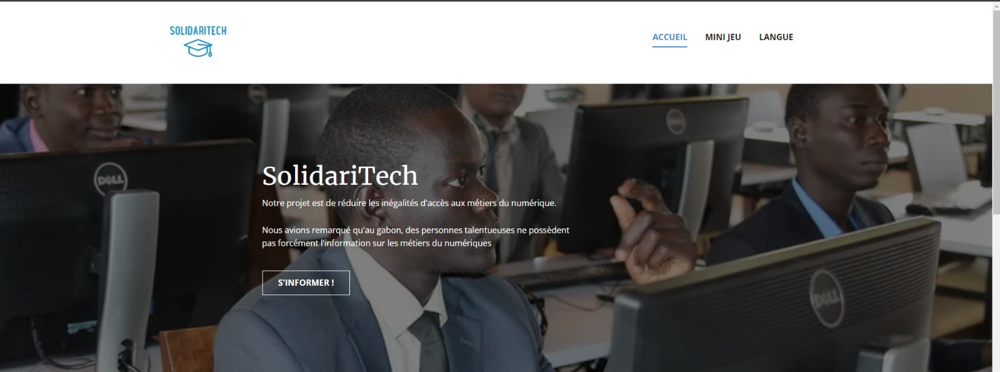

# Site Web Workshop EPSI : SolidarTech

## Description du Projet

Ce projet a été développé par moi-même et mon groupe lors d'un atelier d'une semaine organisé à l'Epsi Paris sur le thème : "Réduire les inégalités d'accès aux métiers numériques". Notre objectif était de créer un site web destiné aux jeunes Gabonais, en particulier aux filles, afin de les initier au domaine de la technologie et au-delà.

Le projet a été réalisé en utilisant les outils suivants :

- NicePage
- HTML
- CSS
- JavaScript

Le résultat final est un site web contenant des liens vers des ressources telles qu'OpenClassroom, ainsi qu'un jeu en CSS et un quiz en HTML. La langue utilisée pour le site web est le français.

## Liens Utiles

- [Site Web de l'École](epsi.fr)
- [Démo](https://wambaforestin.github.io/projet_workshop_epsi/)
- [Plateformes de Tutorat en Ligne](GeeksforGeeks.org)
